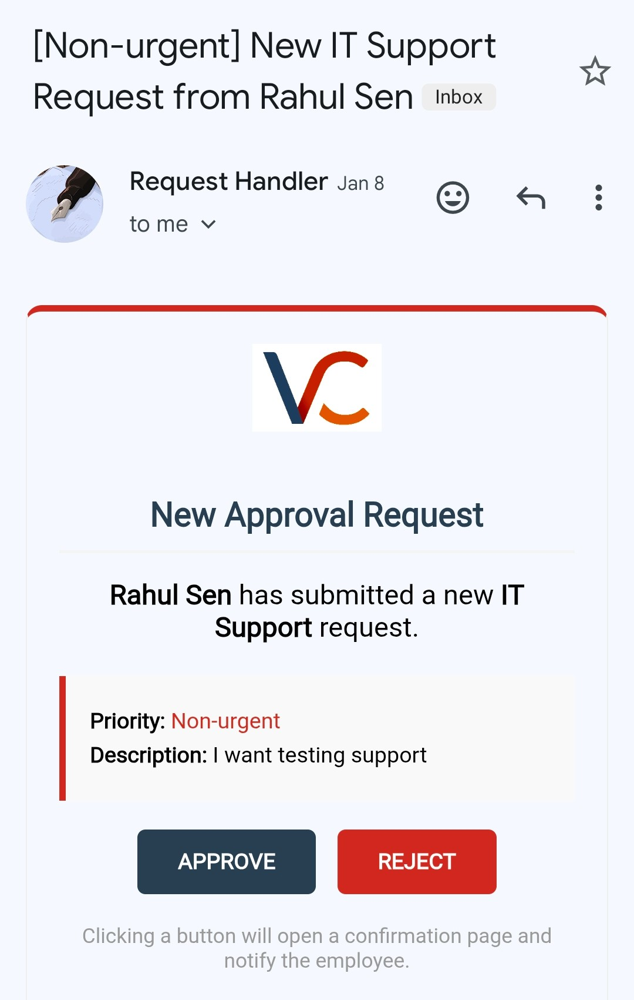

  

# Smart Request Approval System

## 1. Project Overview

The **Smart Request Approval System** is a digital workflow “messenger” that:

1. Collects request data from employees  
2. Routes it to the correct manager for approval  
3. Notifies the employee of the final decision  

It is a **serverless orchestration system** integrating:

- Google Forms  
- Google Sheets  
- Gmail  
- Google Apps Script (Web App Service)  

The workflow operates on an **event-driven model**:

- 📌 **Google Sheet** → Central database  
- ⚙️ **Apps Script** → Backend business logic  

---

## 1.1 Data Entry & Capture (Trigger Layer)

**Source:**  
A multi-layered and structured Google Form with integrated validation collects data.

**Primary Trigger:**  
`onFormSubmit` installable trigger

**Logic:**  
Upon submission, the script extracts the `e.values` object containing user responses.

---

## 1.2 Intelligent Routing Engine

This system does not send emails to a fixed recipient — it routes dynamically.

### 🔎 Dynamic Lookup
The script queries a **“Staff” sheet** to find the submitter’s manager email using VLOOKUP-style logic in JavaScript.

---

## 1.3 Approval Interface (Web App Layer)

Instead of opening a spreadsheet, managers receive an interactive email.

### ✉️ HTML Templates
Uses:HtmlService.createTemplateFromFile()

To generate professional emails with:

- **APPROVE** button  
- **REJECT** button  

### Action Links

Buttons link to a published **Apps Script Web App URL**.

### `doGet(e)` Function

When a manager clicks a button:

- The Web App’s `doGet(e)` function is triggered  
- The script reads URL parameters (`action`, `id`)  
- The corresponding row in the Sheet is updated  

---

# 2. How to Use

## 2.1 For Requesters (Employees)

### How to Submit a Request

Open the Google Form and complete all required fields.

> All fields are mandatory unless marked **Optional**.

---

### Step 1: Basic Information

**Requester Name**  
Must be full name (minimum two words, e.g., “Narendra Modi”).

**Manager’s Email**  
Must be a valid email format.

**Request Type**  
Choose from:

- Leave  
- Access  
- IT Support  
- Travel  
- Budget  
- Other  

---

### Step 2: Leave Details (If Applicable)

If **Leave** is selected:

- Leave Start Date  
- Leave End Date  

---

### Step 3: Request Details (Common for All)

**Priority**

- Urgent  
- Non-Urgent  

**Request Description**

- Clear explanation  
- Maximum 999 characters  

**Supporting Attachment (Optional)**

- Max 1 file  
- Max size: 10MB  
- Accepted formats: PDF, receipt, screenshot, etc.  

---

### Step 4: Submission

- (Optional) Toggle **“Send me a copy of my responses”**  
- Review your entries  
- Click **Submit**

---

### What Happens Next?

- You receive a submission copy (if selected)  
- Your manager receives an approval request  
- You receive an automated Approved/Rejected email with decision date  

---

## 2.2 For Approvers (Managers)

### Reviewing Requests

You will receive an email with subject: [Priority] New [Type] Request from [Name]

**Steps:**

1. Review request details in the email  
2. Click **View Attachment** (if provided)  
3. Click:
   - **APPROVE**
   - **REJECT**

---

### Confirmation Screen

After clicking a button:

- A browser tab confirms your action  

If already processed:

- The system displays an **"Already Processed"** warning  
- Prevents duplicate approvals or accidental changes  

---

## 2.3 For Administrators

### System Management

#### Configuration

- The `Code.gs` file contains a `COLS` configuration block  
- If a Form question title changes, update the `COLS` constant  

#### Tracking

- All decisions and timestamps are logged in Google Sheets  

#### Deployment

Any logic change requires:

- New Web App Deployment  
- Updating the `WEB_APP_URL` constant  

---

# 3. Troubleshooting

| Issue | Cause | Solution |
|-------|--------|----------|
| **"Already Processed" Warning** | Link clicked twice or email security scanner pre-clicked it | Check Google Sheet for current status. No further action required. |
| **"Error" Card in Web App** | `try...catch` block captured failure (e.g., sheet deleted, renamed column) | Check the Apps Script **Executions** tab. Ensure column headers exactly match `COLS` config. |
| **Manager sees "Invalid Request"** | `if (!e.parameter.row)` triggered (URL opened directly without parameters) | Ensure manager clicks the full link inside the email. |
| **Email buttons don't work** | `WEB_APP_URL` points to old or expired deployment | Redeploy as New Version, copy new URL, update `WEB_APP_URL` constant. |
